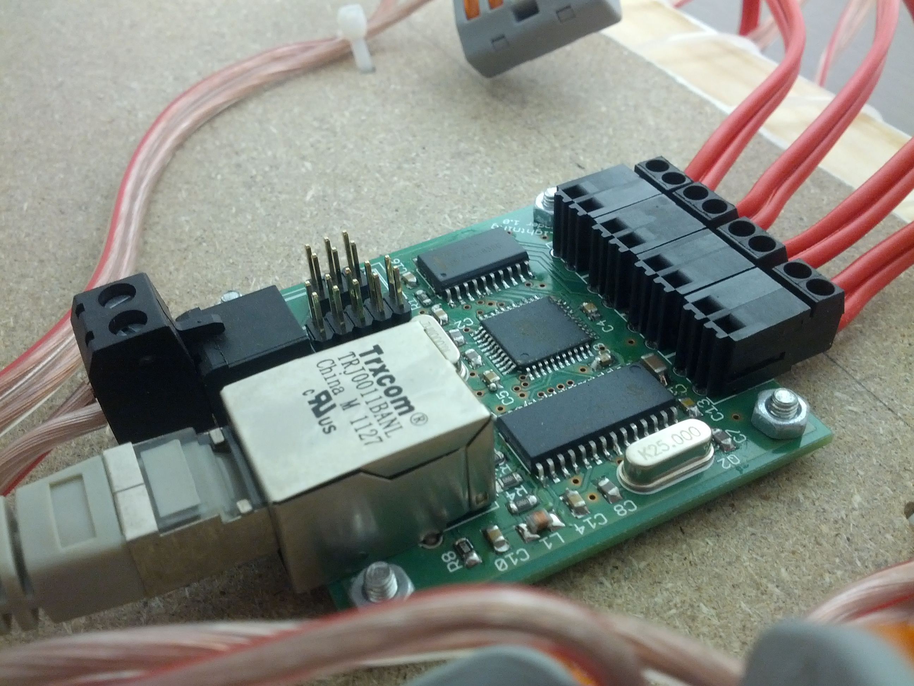
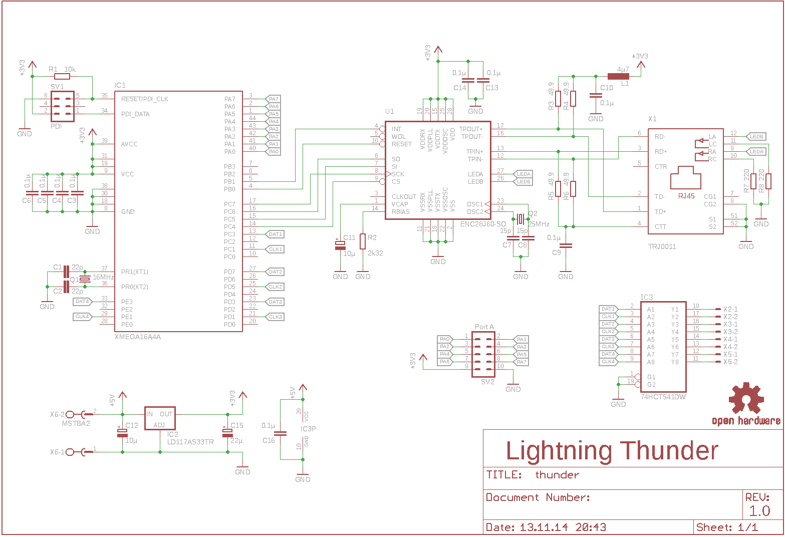
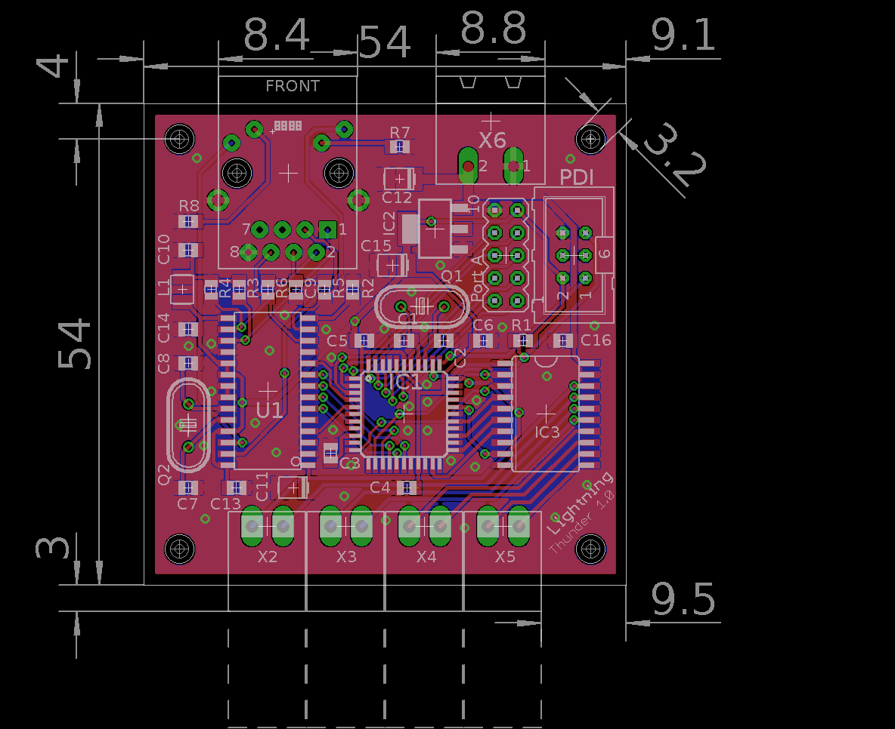
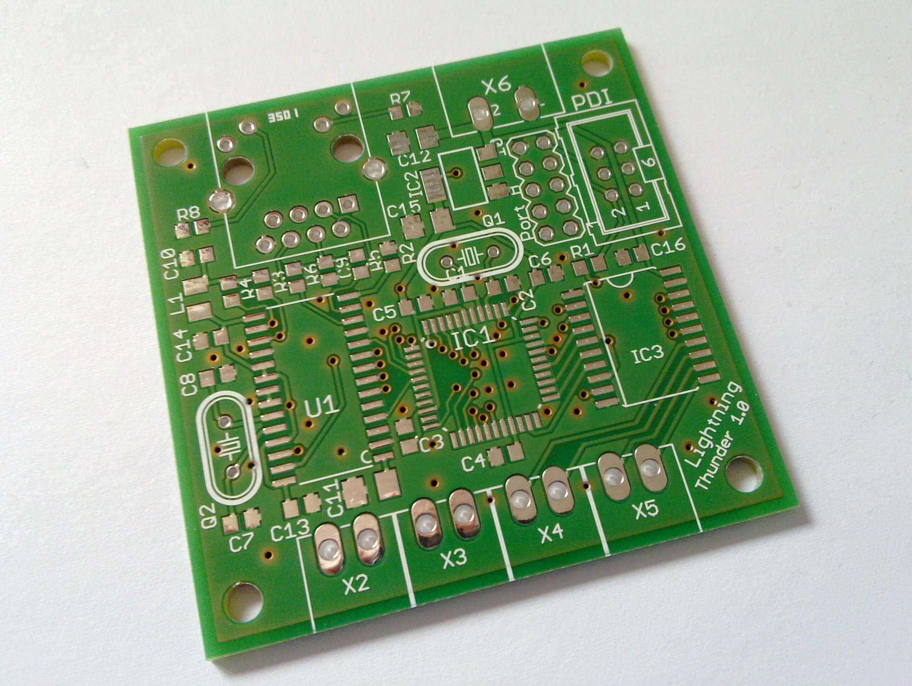
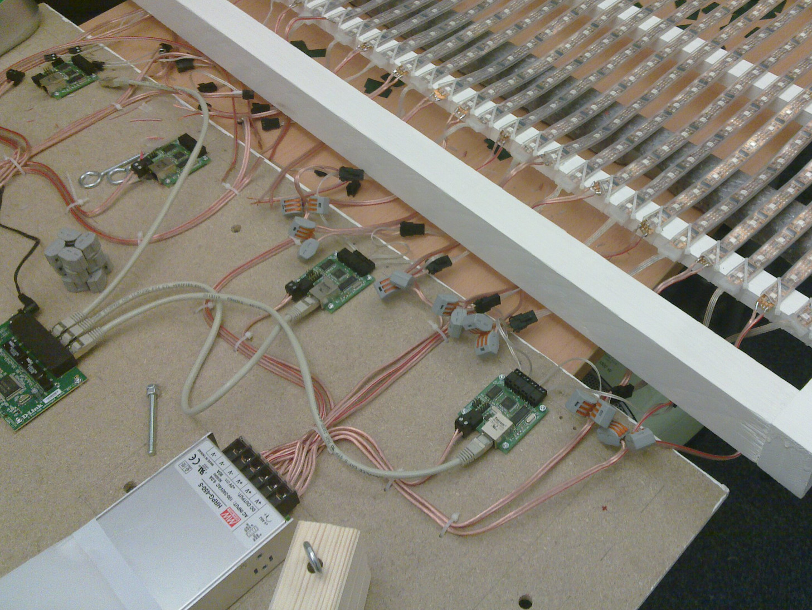
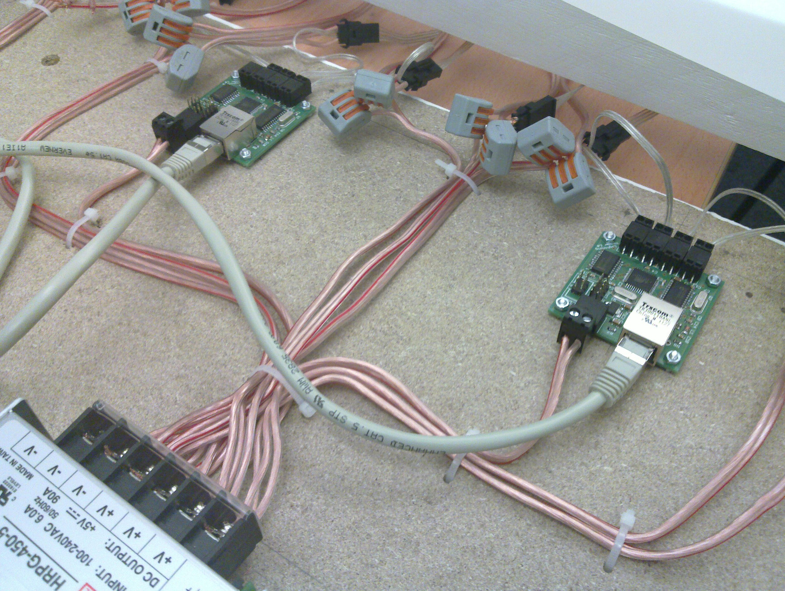
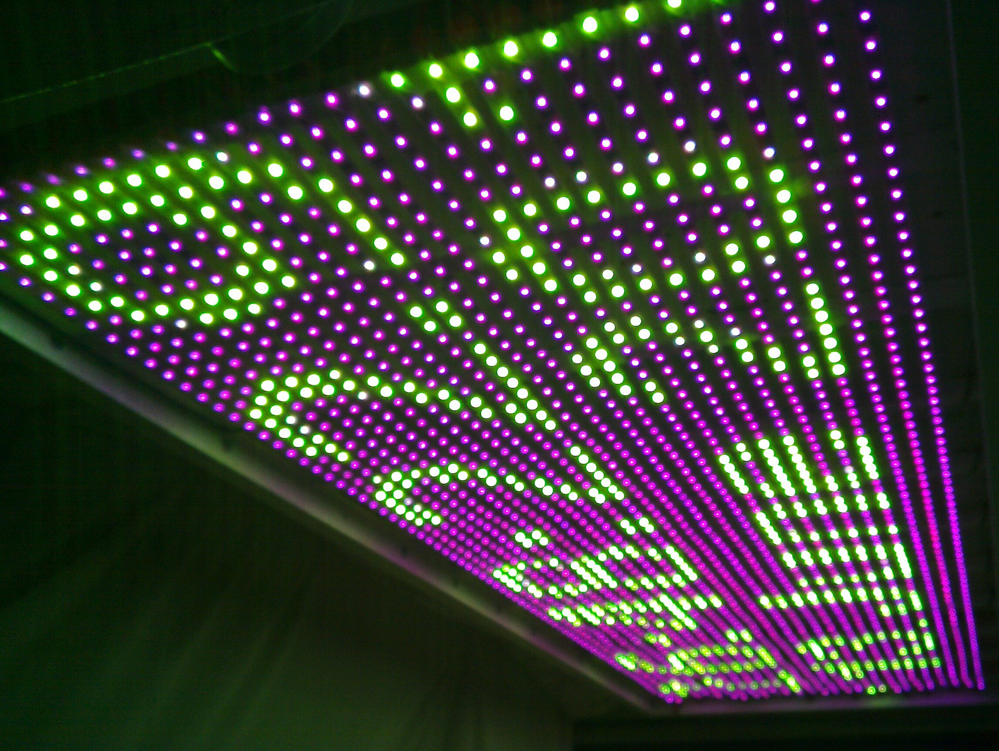

Lightning Thunder
=================

Controlling [LPD8806](https://www.adafruit.com/products/306) based LED Strips over Network.

* control up to 4 LPD8806 based LED Strips
* simple UDP Protocol

Components
----------

Based on:

* [ATxmega16A4](http://www.atmel.com/Images/Atmel-8331-8-and-16-bit-AVR-Microcontroller-XMEGA-AU_Manual.pdf) - Low power, high performance 8/16-bit AVR microcontroller
* [ENC28J60](http://ww1.microchip.com/downloads/en/DeviceDoc/39662e.pdf) - Microchip 10Mbit Ethernet controller with SPI interface

Protocol
--------

`Thunder` recieves UDP data containing the raw LPD8806 data for each Strip
on seperate UDP Ports (50000-50003). It forwards the data directly over SPI, without any checking or modification.

The Host has full control and has to calculate the correct order and
color ordering (RBG -> RGB), etc...

Result
------

LICENSE
-------

Released under the [MIT](http://opensource.org/licenses/MIT) License.
Based on the [Open Source Hardware Definition v1.0](http://www.oshwa.org/definition/).

See the respective source code files for varying Licenses.

